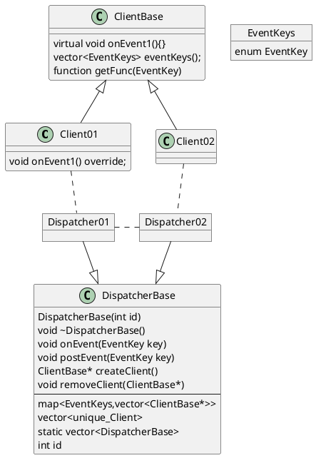

# Kommunikation

## Simple


```puml
@startuml
class Client01{
    void onEvent1() override; 
}
class Client02{

}
class ClientBase{
    virtual void onEvent1(){}
    vector<EventKeys> eventKeys();
    function getFunc(EventKey)
}
Object Dispatcher01{
}
Object Dispatcher02{

}
class DispatcherBase{
    DispatcherBase(int id)
    void ~DispatcherBase()
    void onEvent(EventKey key)
    void postEvent(EventKey key)
    ClientBase* createClient()
    void removeClient(ClientBase*)
    ---
    map<EventKeys,vector<ClientBase*>>
    vector<unique_Client>
    static vector<DispatcherBase> 
    int id
}
object EventKeys{
    enum EventKey
}

Client01 -up-|> ClientBase
Dispatcher01 -down-|> DispatcherBase
Dispatcher02 -down-|> DispatcherBase
Client02 -up-|> ClientBase
Client01 .down. Dispatcher01
Dispatcher01 .right. Dispatcher02
Dispatcher02 .up. Client02

@enduml
```

```code
int main()
{
    Dispatcher d1(1);
    Dispatcher d2(2);    

    ClientBase c1;
    ClientBase c2;
}

```

