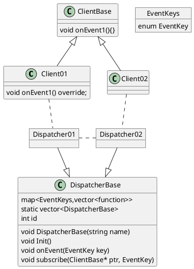

# Kommunikation

## Simple


```puml
@startuml
class Client01{
    void onEvent1() override; 
}
class Client02{

}
class ClientBase{
    void onEvent1(){}
}
Object Dispatcher01{
}
Object Dispatcher02{

}
class DispatcherBase{
    map<EventKeys,vector<function>>
    static vector<DispatcherBase> 
    int id
    void DispatcherBase(string name)
    void Init()
    void onEvent(EventKey key)
    void subscribe(ClientBase* ptr, EventKey)
}
object EventKeys{
    enum EventKey
}

Client01 -up-|> ClientBase
Dispatcher01 -down-|> DispatcherBase
Dispatcher02 -down-|> DispatcherBase
Client02 -up-|> ClientBase
Client01 .down. Dispatcher01
Dispatcher01 .right. Dispatcher02
Dispatcher02 .up. Client02

@enduml
```

```code
int main()
{
    Dispatcher dispatcher1();
    Dispatcher dispatcher2();    
}

```

