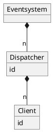
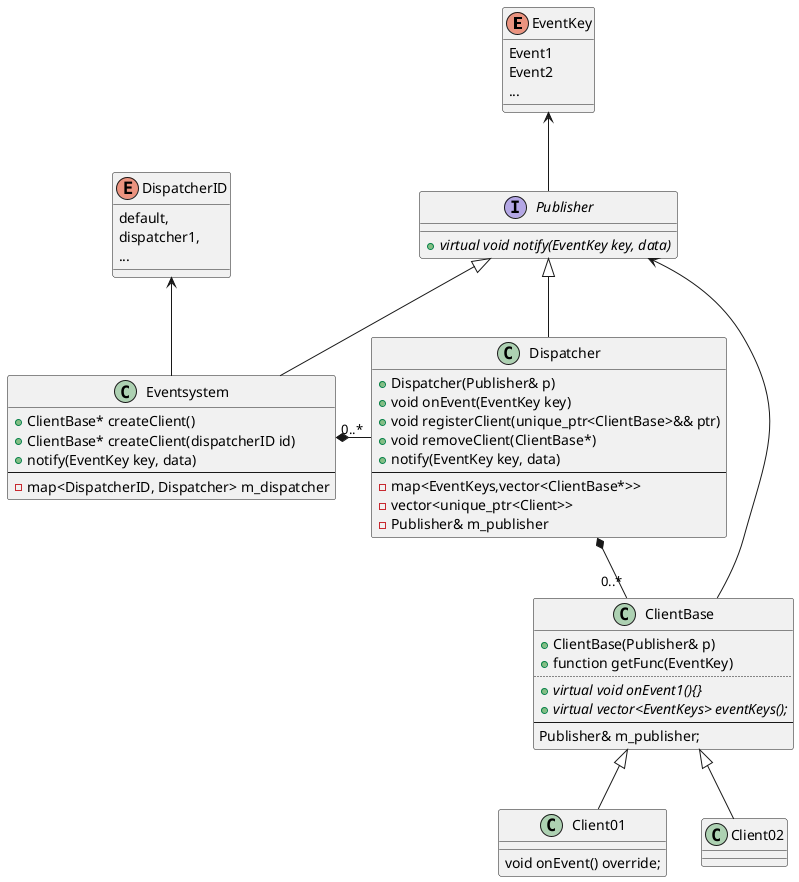
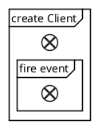
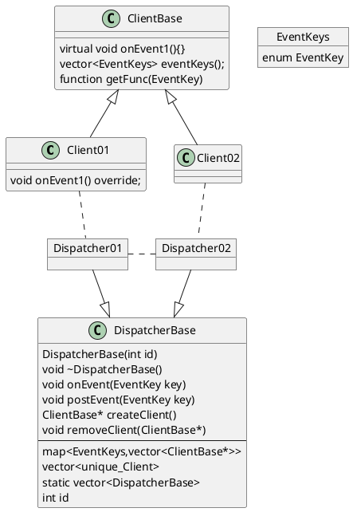

# Kommunikation

## General

### Object

### Class 


### Sequence




```cpp
#include <eventsystem.h>

int main()
{
    Eventsystem e;

    auto c1 = e.addClient(ENUM_CLIENT1, ENUM_DISPATCHER1);
    auto c2 = e.addClient(ENUM_CLIENT2, ENUM_DISPATCHER2);
}

```
## Simple



```code
int main()
{
    Dispatcher d1(1);
    Dispatcher d2(2);    

    ClientBase c1;
    ClientBase c2;
}

```

